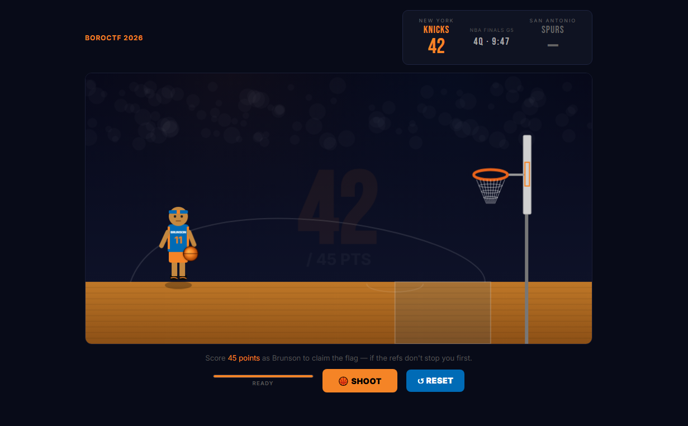
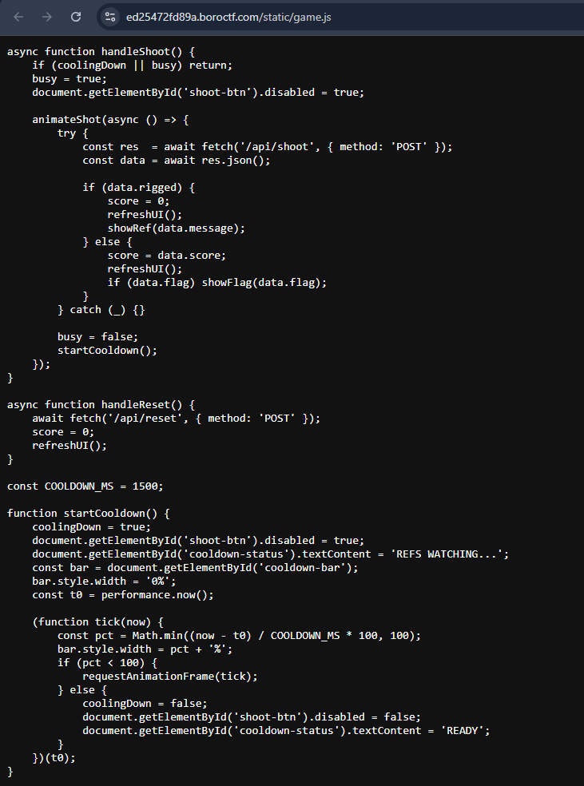
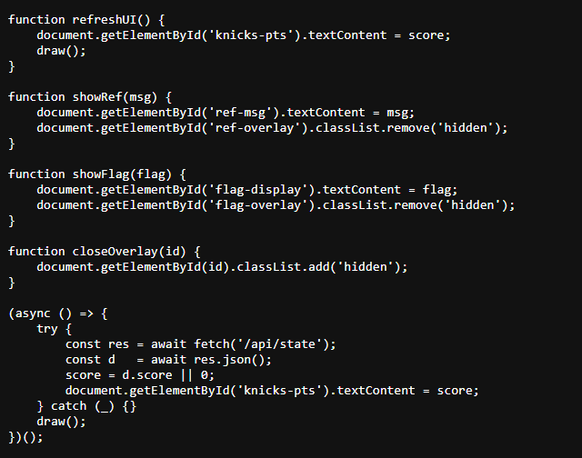
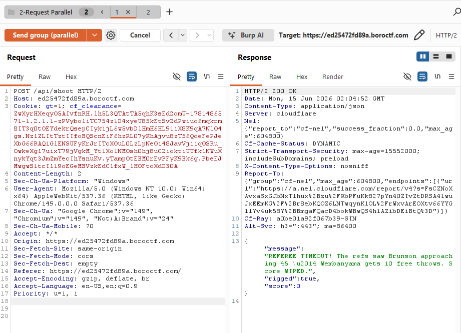
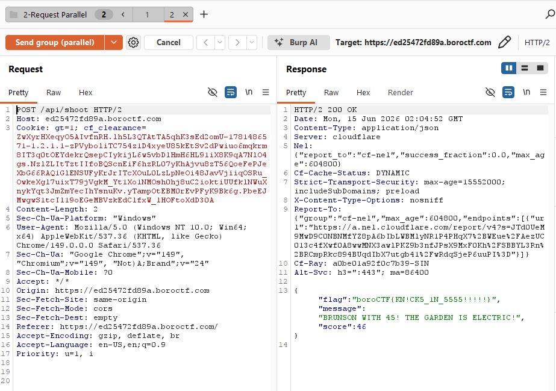

# My Mayor Muslim... - boroCTF

> *My Bagel Jewish... My Christian Dior...*
>
> *(Note: this is the official challenge title and description as given in the CTF)*

**Difficulty:** Medium  
**Category:** Web Exploitation  
**Vulnerability:** TOCTOU Race Condition

---

## What Was Vulnerable

The server checked "has the score reached 45?" as one step, and updated the actual score as a separate step. These two steps were not combined into a single safe operation, so if two requests arrived at almost the same time, both could read the score before either one finished updating it. This let one request "see" a winning score and return the flag, while the other request triggered the reset - even though the score should never have reached exactly 45 through normal play.

---

## How I Found It

### 1. Reconnaissance

The website is a basketball game where I had to score 45 points as the Knicks to beat the Spurs by clicking "SHOOT."



The catch: once the score reached 44, the next shot always returned:

> *"REFEREE TIMEOUT! The refs saw Brunson approaching 45 - Wembanyama gets 10 free throws. Score WIPED."*

The page source referenced an external `game.js` file containing the game logic. The relevant functions:





```javascript
async function handleShoot() {
  if (coolingDown || busy) return;
  busy = true;
  document.getElementById('shoot-btn').disabled = true;

  animateShot(async () => {
    try {
      const res  = await fetch('/api/shoot', { method: 'POST' });
      const data = await res.json();

      if (data.rigged) {
        score = 0;
        refreshUI();
        showRef(data.message);
      } else {
        score = data.score;
        refreshUI();
        if (data.flag) showFlag(data.flag);
      }
    } catch (_) {}

    busy = false;
    startCooldown();
  });
}

async function handleReset() {
  await fetch('/api/reset', { method: 'POST' });
  score = 0;
  refreshUI();
}

const COOLDOWN_MS = 1500;

function startCooldown() {
  coolingDown = true;
  document.getElementById('shoot-btn').disabled = true;
  // ... 1.5s client-side cooldown timer
}
```

### 2. Initial Thought Process

Scoring increased by exactly 2 points per shot: `0, 2, 4, 6 ... 44, 46`. This meant the score could **never land exactly on 45** through normal play - it would always jump from 44 straight to 46, which triggered the rig/reset response every time. The win condition, as designed, looked mathematically unreachable via the front-end flow.

### 3. Investigating with Burp

Each `POST /api/shoot` request was tied to a session cookie (`gt=<session_id>`). Responses followed one of two patterns:

```json
{"score": 4}
```
or, when the rig triggered:
```json
{
  "message": "REFEREE TIMEOUT! Shot clock violation! The refs are rigged for the Spurs - Wembanyama shoots 10 free throws. Score WIPED.",
  "rigged": true,
  "score": 0
}
```

Changing the cookie started a fresh session at score 0. Removing the cookie entirely returned `{"error":"no session"}`.

### 4. Ruling Out Simpler Bypasses

Before pursuing a race condition, I tested several more direct approaches - all of which failed, narrowing down the actual vulnerability:

- **URL parameters:** `POST /api/shoot?score=45` and `POST /api/shoot?rigged=false` - no effect, parameters ignored
- **JSON body manipulation:** `{"points": 1}`, `{"points": -1}` - no effect, the endpoint ignores client-supplied scoring values entirely
- **Form-encoded body:** `points=1` - same result, no effect
- **Reset endpoint tampering:** `POST /api/reset` with `{"score": 43}` - always resets to 0 regardless of the value sent; can't be used to set an arbitrary starting score

With direct manipulation ruled out, I looked at the cooldown timer next. The 1.5 second wait between shots (`COOLDOWN_MS`) only exists in the browser - it's a JavaScript timer that disables the shoot button visually. Nothing in the `/api/shoot` request itself enforces this delay on the server side. This meant I could skip the browser entirely and send shoot requests directly through Burp, as fast and as close together as I wanted.

---

## The Exploit

### Race Condition via Parallel Requests

At score 44, I queued two `POST /api/shoot` requests in a Burp group tab using the same session cookie, then used **"Send group in parallel"**:





**Request 1 response:**
```json
{
  "message": "REFEREE TIMEOUT! The refs saw Brunson approaching 45 - Wembanyama gets 10 free throws. Score WIPED.",
  "rigged": true,
  "score": 0
}
```

**Request 2 response:**
```json
{
  "flag": "boroCTF{KN!CK5_1N_5555!!!!!}",
  "message": "BRUNSON WITH 45! THE GARDEN IS ELECTRIC!",
  "score": 46
}
```

Both requests fired against the same session, at the same score state (44), nearly simultaneously. One was processed along a path that returned the win/flag response; the other triggered the rig/reset response. This confirmed both requests read the same pre-shot score before either write completed - a textbook TOCTOU condition.

I also tried sending 6 parallel `/api/shoot` requests at once - 5 of the 6 responses returned the flag, which further confirmed the race window: with more concurrent requests, the odds of multiple requests reading the same outdated score state before any single write completes goes up significantly.

**Flag:** `boroCTF{KN!CK5_1N_5555!!!!!}`

---

## Why This Works

A **TOCTOU (Time-Of-Check to Time-Of-Use)** race condition happens when a system checks a value (here, the score), but that value can change before the system finishes acting on what it checked. The "check" and the "use" are two separate moments instead of one safe, combined step and if something else changes the value in between, the system ends up acting on outdated information.

Here's the likely sequence on the server for a single shot:

1. Read the current score (44)
2. Add 2 → new score is 46
3. Check: is 46 ≥ 45? → if yes, return the win and the flag
4. Separately: did the score go past 45 without landing exactly on it? → if yes, trigger the rig/reset

Normally, only one request is processed at a time, so this works fine. But when two requests both arrive while the score is still 44, **both** can read 44 before either one finishes writing its update. Each one independently calculates 46, and each one independently runs through the win-check and the rig-check. Depending on the exact order the server happens to process things in, one request can come out the other side reporting a win, while the other reports a reset even though, only one of those outcomes should have been possible.

---

## Techniques Used

1. JavaScript source analysis to understand client-side game logic and identify what was and wasn't server-enforced
2. Burp Suite request interception and parameter/body tampering to rule out simpler bypasses
3. Identifying that a client-side-only cooldown timer implied no server-side rate limiting
4. Burp Suite's "Send group in parallel" feature to exploit a TOCTOU race condition
5. Comparing concurrent response pairs to confirm inconsistent server state handling

---

## Real World Impact

TOCTOU race conditions are a well-documented vulnerability class in financial and inventory systems. A banking application that checks "does this account have sufficient balance?" and then separately processes a withdrawal could be exploited the same way demonstrated here: if a user submits multiple simultaneous withdrawal requests, each request might read the same pre-withdrawal balance before any single withdrawal is committed, allowing more money to be withdrawn than the account actually holds. The same pattern applies to coupon/promo code redemption (redeeming a single-use code multiple times) and inventory systems (purchasing more stock than is available).

---

## Lessons Learned

1. When a value can only take certain states through normal interaction (here, only even numbers), and the target state is impossible to reach normally, that's a strong signal the intended bypass lies outside normal request flow - not in the value itself
2. Client-side-only enforcement (like the cooldown timer here) is a clue, not a guarantee - always verify whether timing, rate limits, or sequencing are actually enforced server-side
3. Burp Suite's "Send group in parallel" feature is the standard tool for testing race conditions - queuing identical requests and firing them simultaneously is often enough to expose non-atomic state handling
4. Race conditions don't always succeed on the first attempt - increasing the number of concurrent requests increased the success rate here (5/6 vs 1/2), since more simultaneous reads increase the odds of overlapping the vulnerable window
5. Ruling out simpler attacks systematically (parameter tampering, body manipulation) before pursuing a more complex technique like a race condition is good methodology - it narrows the actual vulnerability class with evidence rather than guesswork

---

*Written by [Faisal Ulde](https://github.com/faisalulde) | boroCTF 2026*
